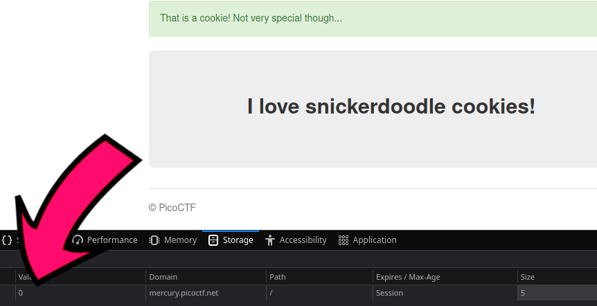

# picoCTF/practiceGym/Cookies

Author: Malate

## Description
The challenge for this particular exercise gives a url complete with port number.  And the following message:
```
Who doesn't love cookies? Try to figure out the best one.
```

No hints are provided/available in the exercise winodw, so loading the site and going from there seems like the best option!


## Initial Load and Research

On the initial load we see a simple layout.  A message mentions a cookie search engine and seeing how much the author likes different kinds of **cookies** (*hint hint!*).
</br></br>
Below that we have a search field with the suggestion of **snickerdoodle**.  Not much else going on that we can see.
</br></br>
We can search for various things.  Trying different forms of injections don't seem to have any impact.  Some cookies will have messages, but not return a flag.
</br></br>
So let's look at what else we get on the initial load of the page.  I'm using **Firefox**, so the built in inspector works well.


</br>

Looking in here we see we have one browser cookie, and on the initial page load the name is **name** and it is set to **-1** for its value.  Interesting.
</br></br>
So what if we search for something which seems to return a positive result, such as **snickerdoodle** or some other cookie?


</br></br>
Looking at the inspector again we see the value for the cookie has changed.  Assuming that the challenge is to get the correct cookie value we could just use the inspector and change the value there to reload the page.  **BUT** we don't know the correct value.
</br></br>
Let's try bruteforcing it with Python using the `requests` module.


## Searching with Python
With `requests` we can not only get the website into Python programmatically, but we can also send **post** queries and even **cookies**.  The latter is what's key here!
</br></br>
I created a python script which iterates over positive values from 0 to 100, substituting that in for the value in the cookie.  After each query with the new cookie value it displays the html which is returned.  Each time it prompts if it should go again (with the next value), any input here including just an enter, other than an `n`, will send it through to the next value.
</br></br>
I could parse out the html tags, but it's a simple html file returned, and what we're looking for might be in comments, we don't know yet.  But let's keep going and look...

## Finding the Flag - Programatically
So the persistence pays off, and we notice one of the times it returns what looks like the **flag** for this challenge!
</br>

</br>
We can have it output the specific value it tries each time for the cookie as well.  Let's take that, go back to the initial page load in our browser, remove old cookies first.  Changing the value in the cookie in the inspector to the correct one we discovered with the python script, then reloading the page, gives us the page displaying the flag here as well.  Perfect!
</br>

</br>
Submitting that to the challenge in **picoCTF** confirms this is the flag we were looking for!

## Using the Script
There are some changes you'll need to make the `solver.py` proof of concept work for you.
</br></br>
First load the page **picoCTF** sends you to in the browser, use the inspector tools to find the cookie and its values, we'll need these to create our cookie in the script.
</br></br>
Lines `6` and `10` need to have the date/time set as a string, just use the ones which are set in your browser when you load the page and it should work fine.
</br></br>
The cookie should have a value for the **Domain** key, copy that and insert that as the missing string on line `7`.
</br></br>
On line `21` you'll need to modify the url to insert the correct domain and port, however leave the `/search` at the end.
</br></br>
WIth these changes it should work for you, but it might be better to try and figure out **why** it works, and **how**, and exploring what you can do in the inspector tools as well.
